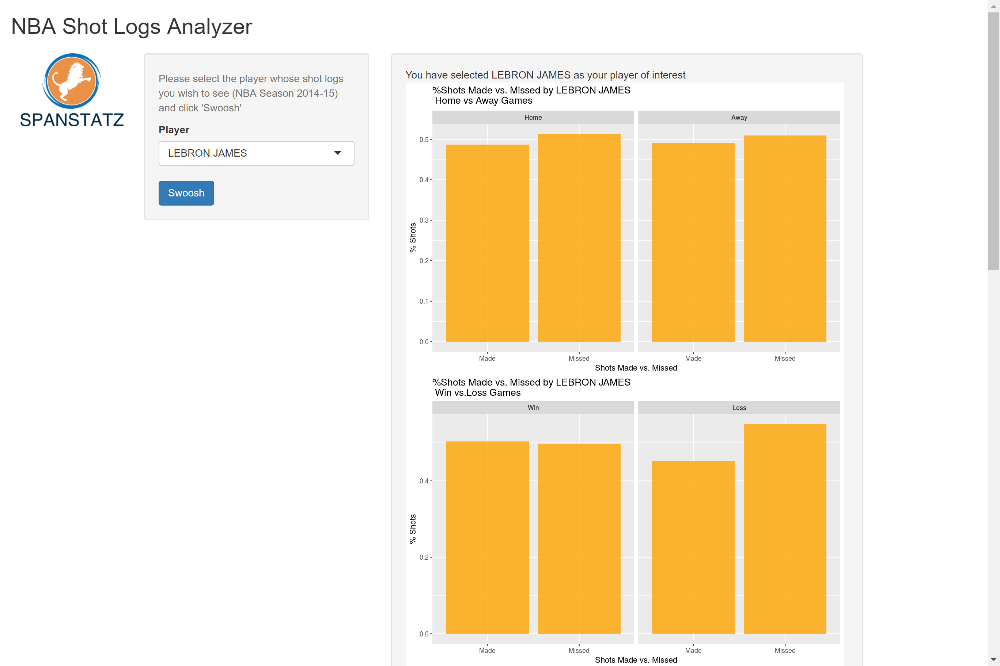

NBA Shot Log Analyzer - An R Shiny App
========================================================
author: Sai S Sampathkumar (github: ssaisushanth45)  
date: 20 July 2017
autosize: true
css: custom.css
transition: linear

App address: <https://ssaisushanth45.shinyapps.io/NBA_Shot_Log_Analyzer/>

NBA Shot Log Analyzer - Data
========================================================

My choice of dataset & application was based on four things:

- Simple to understand
- Fun to play with
- An opportunity to learn something new
- Useful in building my portfolio for my start-up (Spanstatz)

Research on publicly available data sets led me to Dan Becker's Kaggle posting:
<https://www.kaggle.com/dansbecker/nba-shot-logs>

I wanted to create an interactive R Shiny app based on this data to learn and play with something I am passionate about.

As a next step, I hope to add shot chart visualization to this app and may be stretch across to handle different sports (FIFA, NHL, Cricket etc.).

NBA Shot Log Analyzer - App - View
========================================================
class: center-img

The app lets the user choose the player he/she may want to pick to understand better based on NBA season 2014-15

NBA Shot Log Analyzer - Charts - Closer View
========================================================
class: smaller

- As a LeBron James fan who has seen him play for St.Vincents at the Gund (now, Quicken) Arena, I had to start by looking at his numbers.

- App is set for 4 charts: Home vs. Away, Win vs. Loss, By Distance (as Table - just for kicks) and By defender. Embedded code shows only 2 here.

Contact Us
========================================================

We would love to hear from you. Email us:

*sss@spanstatz.com*

**Acknowledgements:** 

Dan B, Ed Maia, Todd Schneider, Andy Lyons, Augustin Luna, Coursera. 

Thank you!! 

